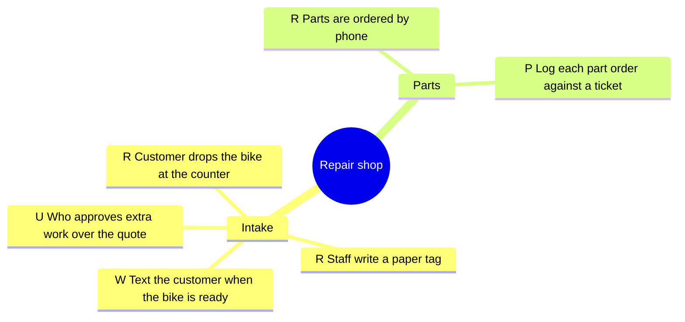
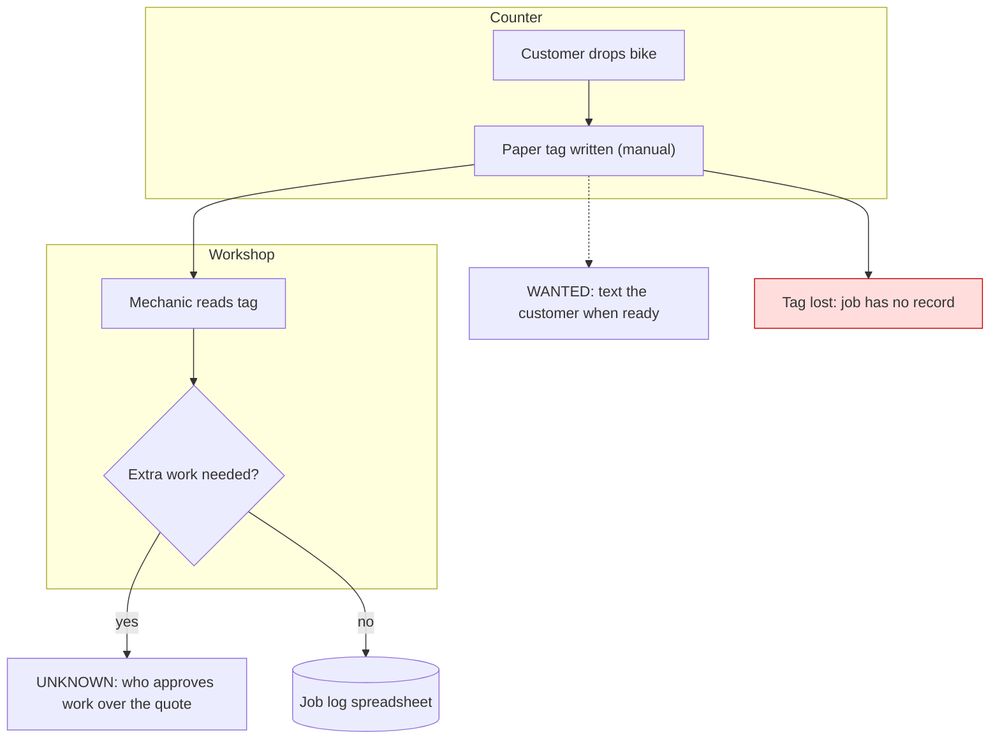
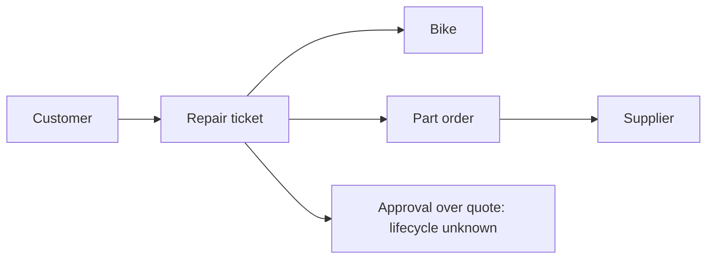
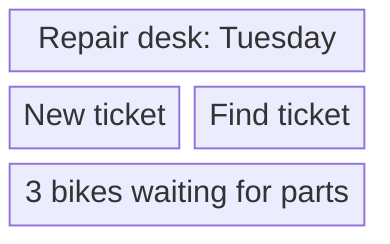
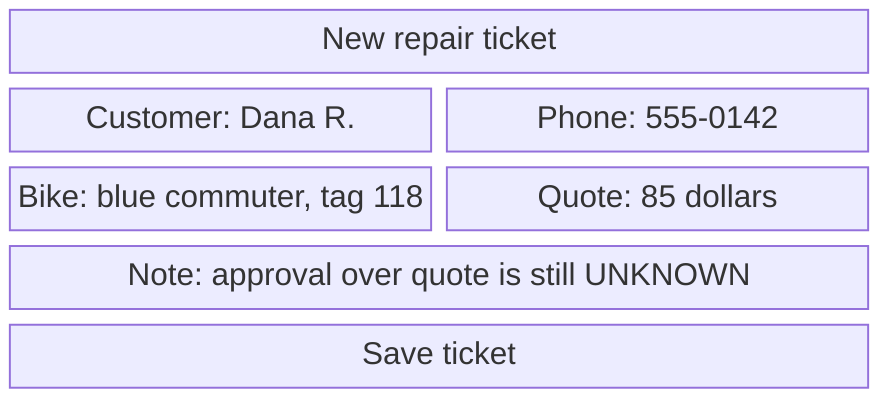
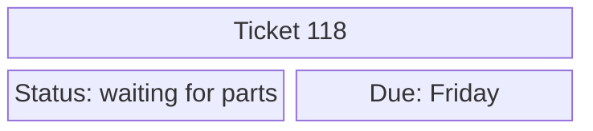
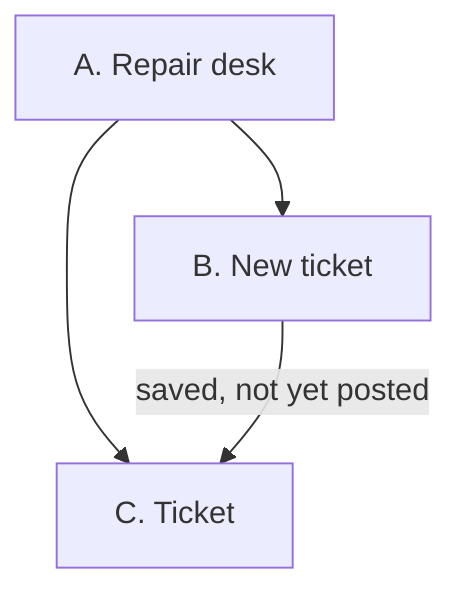

# Pack format and a worked example

The exact conventions `scripts/spec_pack_check.py` depends on, then a complete small pack that
passes the gate. The repo's test suite extracts the example files below and runs the gate on
them, so this example is known to pass.

## Contents

- Folder layout
- Naming rules the gate depends on
- Classes
- manifest.json
- Worked example (a bike repair shop)
- Render skeleton for index.html

---

## Folder layout

```text
.planning/visual-pack/
  01-process-map.mmd            mind map (R/W/P/U on every leaf)
  02-workflow-intake.mmd        one current-state flowchart per workflow
  03-relationship-entities.mmd  entity map ("relationship" in the name)
  04-wireframe-a-home.mmd       one block-beta per screen ("wireframe-<letter>" in the name)
  05-wireframe-b-new-ticket.mmd
  06-wireframe-c-ticket.mmd
  07-navigation.mmd             navigation map ("navigation" in the name)
  screens/                      rendered artboards (HTML) and their PNG screenshots
  manifest.json                 one row per source, with SHA-256
  review-ledger.md              one line per view: reviewer, date, correct / wrong: <words>
  index.md                      the pack's text, ending with ## Plain-English Summary
  index.html                    the rendered page
  vendor/mermaid.min.js         so index.html renders offline
  raw/                          first drafts kept when names or facts are corrected
```

## Naming rules the gate depends on

- A screen's wireframe file name contains `wireframe-<letter>` (A, B, C ...). The letter is the
  screen's id everywhere else.
- The navigation map's file name contains `navigation`. It needs a node whose id starts with
  `HOME`. Label each screen node `"<letter>. <name>"` (for example `NEW["B. New ticket"]`) so
  the gate can match a node to its wireframe letter.
- The entity map's file name contains `relationship`. It is exempt from the UNKNOWN rule.
- Any other flowchart is a workflow and needs an `UNKNOWN:` node, or `"unknowns": "none"` in its
  manifest row.
- In the mind map, leaves are indented 6 spaces or more and start with `R `, `W `, `P ` or `U `.
  Branch lines at 4 spaces are not tagged.
- The gate reads `.mmd` files only. A pack written as one Markdown file with mermaid fences must
  be split into `.mmd` files first.

## Classes

| Where      | Class      | Meaning                                                           |
| ---------- | ---------- | ----------------------------------------------------------------- |
| flowcharts | `reported` | R: the client reported this step                                  |
| flowcharts | `wanted`   | W: the client wants this                                          |
| flowcharts | `proposed` | P: we propose this                                                |
| flowcharts | `unknown`  | U: not established yet (label starts `UNKNOWN:`)                  |
| flowcharts | `issue`    | today's process loses data here (style it red)                    |
| flowcharts | `record`   | a system of record; can be added to a node on top of R/W/P/U      |
| entity map | `note`     | a noun whose lifecycle is unknown                                 |
| wireframes | `header`   | the screen title bar (every wireframe needs one)                  |
| wireframes | `field`    | a value shown or entered, with example data                       |
| wireframes | `action`   | the primary action (exactly one unless the row says menu or none) |
| wireframes | `note`     | an honest caveat                                                  |
| wireframes | `quiet`    | secondary information                                             |

Every node in a flowchart and every block in a wireframe must carry a class.

## manifest.json

A JSON list of objects. Diagram rows:

```json
{
  "file": "05-wireframe-b-new-ticket.mmd",
  "title": "B. New repair ticket",
  "sha256": "<hex>",
  "workflow": "02-workflow-intake",
  "concept": "screens/b-new-ticket-390.png",
  "security": "Counter staff create tickets; only the owner sees supplier cost",
  "actions": "one"
}
```

- `workflow`, `security` are required on wireframe rows. `concept` names the rendered screen
  ("none yet" only until it exists). `actions` is `one` (default), `menu` or `none`.
- Workflow rows may carry `"unknowns": "none"` when a workflow truly has no unknowns.
- A correction note goes in the row: `"note": "customer name corrected A -> B, per the owner"`.

Screen rows (no `file` key) describe rendered artboards. The gate checks that the PNG exists:

```json
{
  "screen": "screens/b-new-ticket-390.png",
  "artboard": "screens/b-new-ticket.html",
  "width": 390,
  "states": ["filled", "empty", "error"]
}
```

---

## Worked example (a bike repair shop)

Three screens: A is the home menu, B creates a repair ticket, C is a read-only ticket view.

#### 01-process-map.mmd



#### 02-workflow-intake.mmd



#### 03-relationship-entities.mmd



#### 04-wireframe-a-home.mmd



#### 05-wireframe-b-new-ticket.mmd



#### 06-wireframe-c-ticket.mmd



#### 07-navigation.mmd



#### manifest.json (hashes computed from the files above)

```json
[
  { "file": "01-process-map.mmd", "title": "Process map", "sha256": "<hex>" },
  {
    "file": "02-workflow-intake.mmd",
    "title": "Intake today",
    "sha256": "<hex>"
  },
  {
    "file": "03-relationship-entities.mmd",
    "title": "Entities",
    "sha256": "<hex>"
  },
  {
    "file": "04-wireframe-a-home.mmd",
    "title": "A. Repair desk",
    "sha256": "<hex>",
    "workflow": "02-workflow-intake",
    "concept": "none yet",
    "security": "Any signed-in staff member",
    "actions": "menu"
  },
  {
    "file": "05-wireframe-b-new-ticket.mmd",
    "title": "B. New ticket",
    "sha256": "<hex>",
    "workflow": "02-workflow-intake",
    "concept": "none yet",
    "security": "Counter staff create; only the owner sees supplier cost",
    "actions": "one"
  },
  {
    "file": "06-wireframe-c-ticket.mmd",
    "title": "C. Ticket",
    "sha256": "<hex>",
    "workflow": "02-workflow-intake",
    "concept": "none yet",
    "security": "Staff see status; customer phone hidden from the workshop tablet",
    "actions": "none"
  },
  { "file": "07-navigation.mmd", "title": "Navigation", "sha256": "<hex>" }
]
```

#### index.md (ends with the summary)

```markdown
# Repair shop visual pack

Rendered screens, then the maps. See manifest.json for sources.

## Plain-English Summary

**What we're building**: a counter screen that replaces paper repair tags.
**Why this piece**: lost tags mean lost jobs.
**The surprise**: nobody owns approval for work over the quote.
**The real problem I caught**: a lost tag leaves no record at all.
**Where we are right now**: pictures only; nothing is built or connected.
**The one thing left**: the owner marks anything wrong in the pictures.
```

The example's `concept` fields say "none yet", which the gate allows. The owner's visual review
does not start until each names a rendered screen.

---

## Render skeleton for index.html

Paste each `.mmd` file's text, in manifest order, into its own `<pre class="mermaid">`. Put the
rendered screens first. Escape `<`, `>` and `&` inside the diagram text.

```html
<!doctype html>
<html lang="en">
  <head>
    <meta charset="utf-8" />
    <meta name="viewport" content="width=device-width, initial-scale=1" />
    <title>Repair shop visual pack</title>
    <style>
      body {
        font:
          16px/1.5 system-ui,
          sans-serif;
        max-width: 1100px;
        margin: 0 auto;
        padding: 16px;
      }
      img.screen {
        max-width: 100%;
        border: 1px solid #ccc;
      }
      pre.mermaid {
        background: #fff;
      }
    </style>
  </head>
  <body>
    <h1>Repair shop visual pack</h1>
    <h2>Screens</h2>
    <figure>
      
      <figcaption>B. New ticket (390 px, filled)</figcaption>
    </figure>
    <h2>01. Process map</h2>
    <pre class="mermaid">
mindmap
  root((Repair shop))
  </pre>
    <!-- one h2 + pre per source, in manifest order -->
    <h2>Plain-English Summary</h2>
    <!-- the six headings from index.md -->
    <script src="vendor/mermaid.min.js"></script>
    <script>
      mermaid.initialize({ startOnLoad: true, securityLevel: "strict" });
    </script>
  </body>
</html>
```
